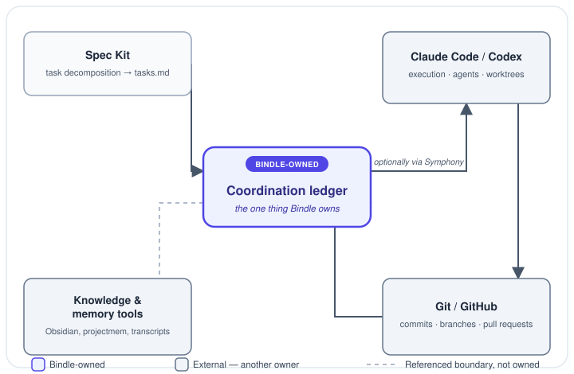

Toolchain bridge

<h1 class="bindle-hero-title">Bindle</h1>

Bindle is a stateless toolchain bridge with respect to your history,
knowledge, and transcripts &mdash; and durably owns one small thing of its
own: a repository-local coordination ledger tracking specified work.

<a class="bindle-cta bindle-cta-primary" href="site/getting-started/">Getting Started &rarr;</a>
<a class="bindle-cta" href="site/how-bindle-works/">How Bindle Works</a>
<a class="bindle-cta" href="site/spec-kit-and-symphony/">Spec Kit &amp; Symphony</a>

The indigo box is the only state Bindle itself durably owns. Every other box already belongs to a system that owns it &mdash; Bindle connects them without replacing them.

<ul class="bindle-routes">
<li class="bindle-route"><a href="site/getting-started/">Getting Started</a>
Provision Bindle in a disposable repository and run the real coordination flow end to end.
</li>
<li class="bindle-route"><a href="site/spec-kit-and-symphony/">Spec Kit &amp; Symphony</a>
The practical workflow, with a diagram: how work moves from a Spec Kit <code>tasks.md</code> through Bindle's ledger to execution, manually or via the optional Symphony coordinator.
</li>
<li class="bindle-route"><a href="site/how-bindle-works/">How Bindle Works</a>
The mental model: what Bindle owns, what it hands off, and who decides when work is done.
</li>
</ul>

<h2>Reference</h2>

Every existing architecture document is rendered directly from its one
canonical source, reachable from the navigation above:
<a href="PHILOSOPHY/">Philosophy</a>,
<a href="SCOPE/">Scope</a>,
<a href="DATA-OWNERSHIP/">Data Ownership</a>,
<a href="SYMPHONY/">Symphony</a>,
<a href="WORKTREES/">Worktrees</a>,
<a href="PRIVACY/">Privacy</a>,
<a href="TOOLCHAIN/">Toolchain</a>, and the
<a href="DECISIONS/">Decision Log</a>.

